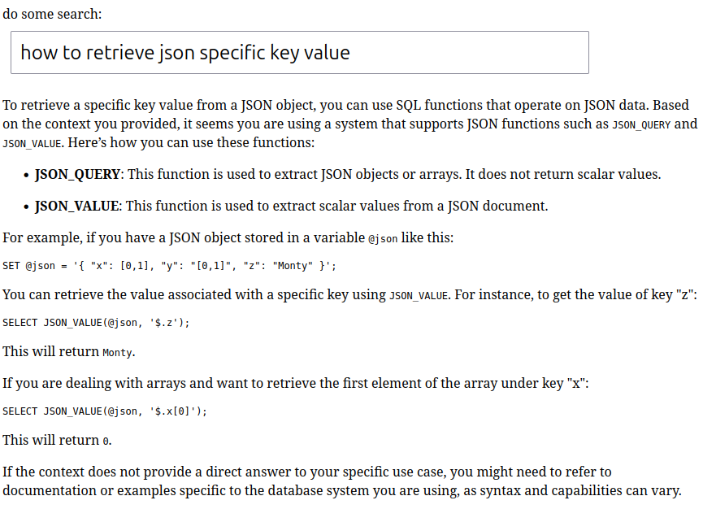

## Spring AI use with MariaDB database store and openAI

These example will retrieve MariaDB documentation (4000+ pages) and using openAI Model, store it in MariaDB database.
(This requires mariadb 11.7 database).

run the example using

```
mvn spring-boot:run
```

calling http://localhost:8080/init to initialize MariaDB store with the documentation pdf content. 

then go to http://localhost:8080/ to makes queries. 

example :
http://localhost:8080/search?message=how+to+retrieve+json+specific+key+value

will returns :

